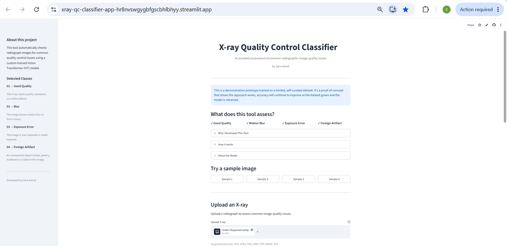
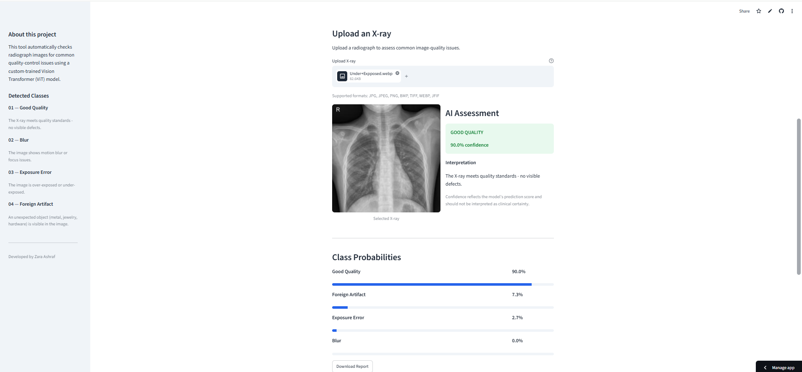
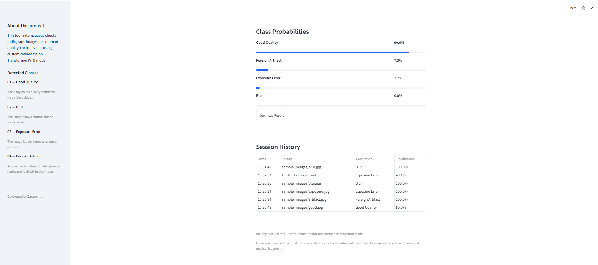
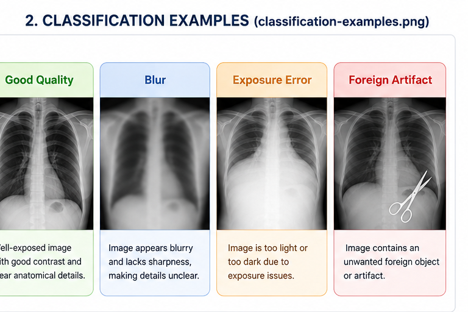
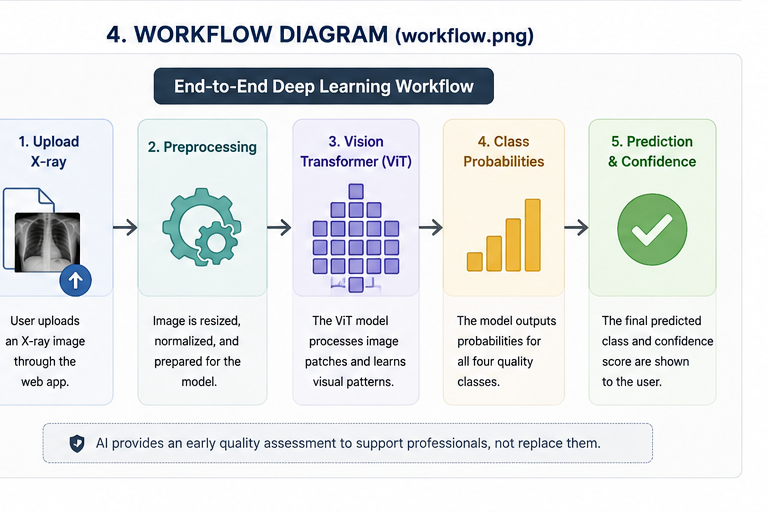
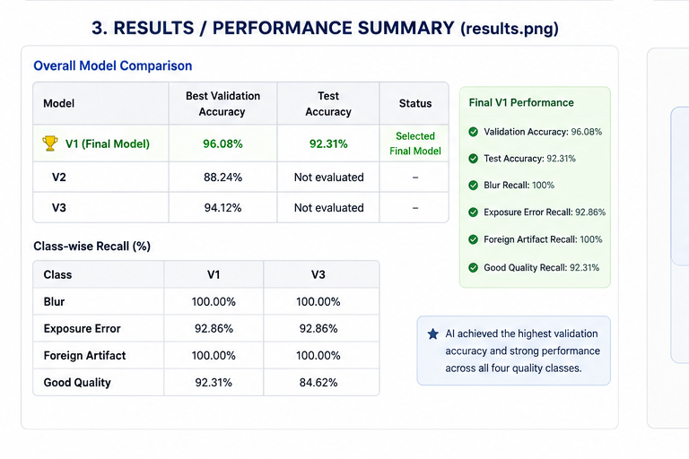

# 🩻 X-ray Quality Control Classifier

## Vision Transformer-Based Automated Quality Assessment of X-ray Images

**Medical Imaging Technology × Artificial Intelligence**

*Interactive Streamlit application for automated X-ray image-quality assessment.*

---

## 🚀 Try the Live App | 📊 View Results | 🔬 Model Interpretability

[**🌐 Try the Live App**](https://xray-qc-classifier-app-hr8nvswgygbfgscbhlbhyy.streamlit.app/) · [**📊 View Results**](#-results) · [**🔬 Model Interpretability**](#-model-interpretability)

**🤗** [**View the trained ViT model**](https://huggingface.co/zara14ashraf/xray-qc-vit) · **💻** [**View the source code**](https://github.com/zara14ashraf-web/xray-qc-classifier-app)
## 🖥️ Application Preview

The deployed Streamlit application provides an interactive interface for uploading an X-ray image and viewing the model's predicted quality class and confidence probability.

### Application Screenshots

---

## Introduction

Image quality is a fundamental part of medical radiography. Blur, exposure errors, and foreign artifacts can compromise the usefulness of a radiograph and may lead to additional review or repeat imaging.

As a **Medical Imaging Technology student**, I developed this project to explore how Artificial Intelligence could provide an **early quality-control assessment** of X-ray images.

The system uses a **Vision Transformer (ViT)** to classify radiographs into four image-quality categories:

**Good Quality · Blur · Exposure Error · Foreign Artifact**

The aim is to explore whether an AI-assisted quality-control step could **identify potentially unsuitable images earlier, reduce avoidable workflow delays, and support more efficient image-quality assurance**.

The system is designed to **support—not replace—radiographers, radiologists, or other qualified healthcare professionals**. Final decisions regarding image acceptability or repeat imaging remain under professional oversight.

---

## 🎯 Why This Project?

In radiography, obtaining a useful image involves more than image acquisition alone. Patient motion, exposure-related problems, and unwanted objects can affect image quality and may require professional review.

This project explores a practical question:

**What if AI could provide an early quality check before an X-ray image moves further through the workflow?**

An automated first-level assessment could potentially help:

- Identify quality problems earlier
- Support faster quality assurance
- Reduce avoidable workflow delays
- Flag potentially unsuitable images for professional review
- Support more consistent image-quality assessment

The purpose is **not to automate professional judgment**, but to explore AI as an additional quality-control layer within medical imaging.

---

## 🔍 What It Does

The application performs **four-class X-ray image-quality classification**:

| Class | Description |
|---|---|
| 🟢 **Good Quality** | Image meets the quality characteristics represented by the Good Quality class |
| 🔵 **Blur** | Image contains blurring that may reduce visibility of anatomical detail |
| 🟠 **Exposure Error** | Image contains an exposure-related quality problem |
| 🔴 **Foreign Artifact** | Image contains an unwanted foreign object or artifact |

### Workflow

**Upload X-ray → Preprocessing → Vision Transformer → Class Probabilities → Predicted Class + Confidence**

The system assesses **image quality only** and does not diagnose disease or interpret clinical findings.
### Four Quality Categories

  

*Representative examples of the four image-quality categories.*

---

## 📊 Dataset

The dataset was **curated from multiple publicly available X-ray datasets and image collections on Kaggle**, rather than from a single source.

Considerable effort was involved in collecting, reviewing, organizing, and preparing images into the four target categories:

**Good Quality · Blur · Exposure Error · Foreign Artifact**

### Preparation

The curated images underwent:

- Image review and organization
- Quality-category assignment
- Preprocessing
- **224 × 224** image resizing
- Normalization
- Training-time augmentation

Because the images originated from multiple sources, variations in acquisition conditions, equipment, and image characteristics may exist. Independent external validation would therefore be important for assessing generalizability.

---
## 🧠 Methodology

The project followed an end-to-end deep-learning workflow:

**Dataset Curation → Image Preprocessing → Data Augmentation → Vision Transformer Training → Model Comparison → Class-wise Evaluation → Final Model Selection → Model Hosting → Streamlit Deployment**
### End-to-End Workflow

  

### Vision Transformer

A **Vision Transformer (ViT)** was used for four-class X-ray image-quality classification.

The model processes an image as a sequence of patches and uses self-attention mechanisms to learn relationships between different image regions.

Multiple model versions were developed and evaluated before selecting the final configuration.

**Final model weights:** `best_xray_qc_vit.pth`

---

## 📈 Results

Three model versions (**V1, V2, and V3**) were compared during development.
### Performance Summary

  

| Model | Best Validation Accuracy | Test Accuracy | Status |
|---|---:|---:|---|
| 🏆 **V1** | **96.08%** | **92.31%** | **Selected Final Model** |
| V2 | 88.24% | Not evaluated | — |
| V3 | 94.12% | Not evaluated | — |

**V1 was selected as the final model** because it achieved the highest validation accuracy and demonstrated strong performance across all four classes.

### Class-wise Recall

| Class | V1 | V3 |
|---|---:|---:|
| Blur | **100%** | **100%** |
| Exposure Error | **92.86%** | **92.86%** |
| Foreign Artifact | **100%** | **100%** |
| Good Quality | **92.31%** | 84.62% |

V1 and V3 performed equally for **Blur, Exposure Error, and Foreign Artifact**. The main difference was in **Good Quality**, where V1 achieved higher recall.

### Final V1 Performance

- **Validation Accuracy:** 96.08%
- **Test Accuracy:** 92.31%
- **Blur Recall:** 100%
- **Exposure Error Recall:** 92.86%
- **Foreign Artifact Recall:** 100%
- **Good Quality Recall:** 92.31%

These results demonstrate promising performance on the evaluated data. Further external validation would be required to assess robustness across unseen clinical environments.

---

## 🔬 Model Interpretability

The current application provides the predicted class and confidence probability, but does not yet provide a validated visual explanation of which image regions influenced the prediction.

Because the model is based on a Vision Transformer, future work could explore:

- Attention visualization
- Attention rollout
- Saliency-based methods
- Other suitable explainability techniques

Interpretability could support **model auditing, error analysis, and investigation of failure cases**.

However, visual explanations should not be interpreted as definitive evidence of clinical reasoning.

---

## 🏥 From Prototype to Practice

The project explores how an AI quality-control model could potentially fit into a radiography workflow.

A potential workflow is:

**X-ray Acquisition → AI-Assisted Quality Check → Quality Assessment → Professional Review or Workflow Continuation**

If appropriately validated, such a system could act as an **early quality-control checkpoint**, flagging potentially unsuitable images for professional review before unnecessary workflow delays occur.

The AI would remain a **supportive tool**, with final decisions made by qualified imaging professionals.

---

## 🌐 Deployment

The trained model was integrated into a **Streamlit** web application.

| Component | Platform | Purpose |
|---|---|---|
| **Source Code** | GitHub | Application and project files |
| **Model Weights** | Hugging Face | Hosting the `.pth` model |
| **Web Application** | Streamlit | Interactive model interface |

The large model file is hosted separately on Hugging Face rather than stored directly in GitHub.

### Deployment Flow

**GitHub → Hugging Face Model → Streamlit Application → User**

---

## ⚠️ Limitations

- The dataset was curated from multiple public sources and may contain differences in acquisition conditions and image characteristics.
- The model currently covers only **four predefined quality categories**.
- Performance may differ on images from unseen hospitals, equipment, or acquisition protocols.
- The system has **not undergone clinical validation** or prospective workflow evaluation.
- Confidence probabilities should not be interpreted as clinical certainty.
- The model should not independently determine whether an examination should be rejected or repeated.

The current system should therefore be considered a **proof-of-concept for AI-assisted X-ray quality assessment**, rather than a clinically validated system.

---

## 📝 Note on the Process

This project was developed as a hands-on exploration of the intersection between **Medical Imaging Technology and Artificial Intelligence**.

The work extended beyond model training to include **dataset curation, preprocessing, augmentation, model comparison, evaluation, model hosting, and deployment of a working application**.

The iterative development process explored how a practical medical-imaging problem can be translated into an end-to-end AI solution.

---

## 🛠️ Technologies Used

**Python · PyTorch · Torchvision · TIMM · Pillow · Streamlit · Hugging Face · GitHub**

| Technology | Role |
|---|---|
| **Python** | Core programming |
| **PyTorch** | Deep learning and inference |
| **Torchvision** | Image preprocessing |
| **TIMM** | Vision Transformer implementation |
| **Pillow** | Image handling |
| **Streamlit** | Interactive web application |
| **Hugging Face** | Model hosting |
| **GitHub** | Source control |

**Core Architecture:** Vision Transformer (ViT)

---

## ⚠️ Responsible Use & Disclaimer

This project is intended for **educational, research, and demonstration purposes**.

The X-ray Quality Control Classifier assesses **image quality**, not disease or patient condition.

It is **not intended to replace radiographers, radiologists, or other healthcare professionals**. Any decision regarding image acceptability, repeat imaging, or clinical use must remain under appropriate professional oversight.

Before real-world clinical implementation, the system would require **independent external validation, clinical workflow evaluation, safety assessment, and applicable regulatory review**.

> **AI should support professional expertise—not replace it.**

---

## 🔗 Project Links

- 🌐 [**Live Streamlit Application**](https://xray-qc-classifier-app-hr8nvswgygbfgscbhlbhyy.streamlit.app/)
- 📊 [**View Model Results**](#-results)
- 🔬 [**Model Interpretability**](#-model-interpretability)
- 🤗 [**Hugging Face Model**](https://huggingface.co/zara14ashraf/xray-qc-vit)
- 💻 [**GitHub Repository**](https://github.com/zara14ashraf-web/xray-qc-classifier-app)

---

## 🙏 Acknowledgement

This project represents an independent exploration of **Medical Imaging Technology and Artificial Intelligence**, combining radiographic image-quality concepts with deep-learning model development and deployment.

It reflects an interest in developing **responsible AI tools that can support medical imaging professionals and improve healthcare workflows**.

---

## 👩‍⚕️ About the Developer

**Medical Imaging Technology Student**

**Medical Imaging • Artificial Intelligence • Healthcare Technology • Research**

This project represents an ongoing exploration of how emerging technologies can be responsibly applied to real-world challenges in medical imaging.

Medical Imaging • Artificial Intelligence • Healthcare Technology • Research
